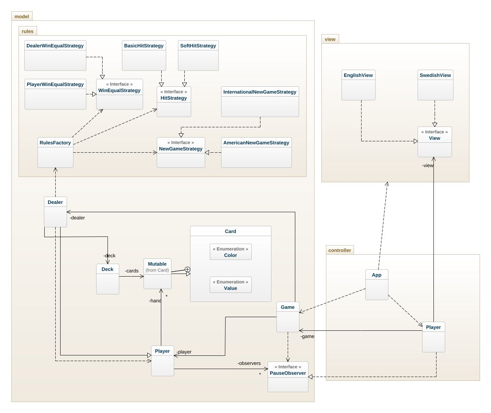

# BlackJack OO-Design
This document describes my updated design. Note that some dependencies have been left out for readability reasons. For example there are a lot of dependencies to the Card class, and also a lot of interfaces have dependency to Player.

## Updated Class Diagram
The application uses the model-view-controller (MVC) architectural pattern. The view is passive and gets called from the controller. I have implemented the Observer Pattern and more interfaces and implementation that follows Strategy pattern within the rules package in the model.

